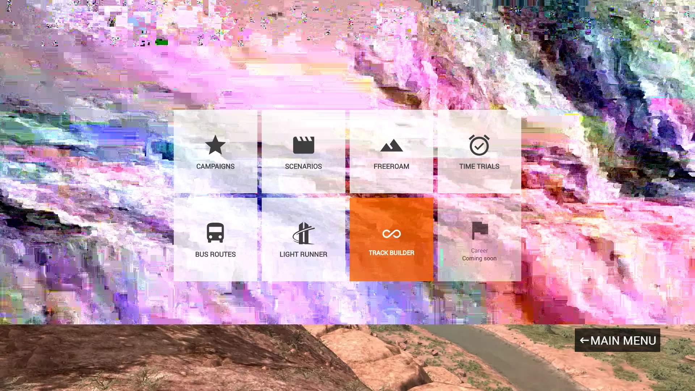

This background image is the result of some visual artifacts I encountered while playing [BeamNG.Drive](https://www.beamng.com/).

Something broke, but I was still able to take a screenshot of it. 

After capturing this image, I repeatedly selected small rectangles and randomly copied them over the image to create my own special wallpaper.
I also created a [Reddit post](https://www.reddit.com/r/BeamNG/comments/bkp84b/modern_art/).

I have used this image as my desktop background and profile picture for a few years now and I still think it is cool and original.
